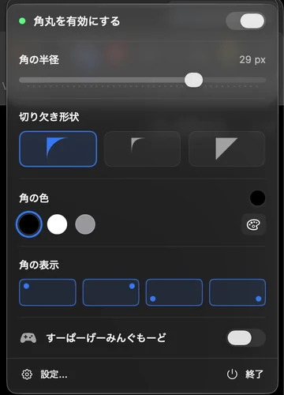

#  Rounder

A tiny menu-bar app that beautifully rounds the corners of your macOS screen.

[](https://github.com/nisesimadao/Rounder/releases/latest)
[](https://github.com/nisesimadao/Rounder/actions/workflows/release.yml)
[](#system-requirements)

Rounder gives modern rounded corners to older MacBooks and external monitors that still have sharp rectangular edges. It runs quietly in the menu bar, needs **no Accessibility or Screen Recording permission**, and lets you adjust everyday corner controls live with **no restart**.


### Quick controls from the menu bar

Radius, corner shape, quick colors, per-corner visibility, Gaming Mode, Settings and Quit are all available directly from the menu-bar panel.



[日本語版READMEはこちら](./README_jp.md)

> Note: On Macs with a notch, the built-in display already has physically rounded corners, so this app has no visible effect there. It's most useful on external displays and older Macs.

## At a Glance

- **Best for external monitors** that still have sharp rectangular corners
- **No invasive permissions**: no Accessibility, Screen Recording, Automation, or network access
- **Live menu-bar controls** for radius, shape, quick colors, individual corners, and Gaming Mode
- **Small surface area**: local settings in `UserDefaults`, menu-bar-first UI, open-source Swift code

## Download

Download the latest build from [Releases](https://github.com/nisesimadao/Rounder/releases/latest).

- `Rounder.zip` — the app

Rounder is currently distributed as an unsigned app. If macOS blocks the first launch, right-click `Rounder.app`, choose **Open**, then **Open** again. See [FAQ](./docs/FAQ.md) for details.

## Why Rounder?

- Works without special macOS permissions
- Covers external monitors and multi-display setups
- Fast day-to-day controls directly from the menu bar
- Per-corner and per-display control
- Presets for switching between subtle, all-corner, and gaming-style setups

## Features

- **Live menu-bar panel** — adjust radius, shape, quick colors, corner visibility and Gaming Mode without opening Settings
- **Instant radius / shape updates** — existing overlay windows resize in place for smooth, flicker-free adjustments
- **Runs in the menu bar** — quiet background utility, no Dock icon during normal use
- **One-click on/off** — toggle the effect straight from the menu bar
- **Launch at Login** — set it once and forget it (via `SMAppService`)
- **Adjustable radius & color** — 0–40 px, any color, with quick black/white/gray swatches
- **Three corner shapes** — Rounded, Squircle, and Polygon cutout
- **Per-corner control** — enable each of the four corners independently
- **Multi-monitor** — choose exactly which displays get rounded corners; newly connected displays are handled by display monitoring
- **Presets** — save, apply, and edit favorite configurations (ships with All / Top / Bottom / Left / Right / None)
- **Super Duper Gaming Mode** — animated rainbow glow with adjustable speed, intensity, and bloom width
- **No special permissions** — draws with borderless overlay windows, so no Accessibility / Screen Recording / Automation prompts

## System Requirements

- macOS 14.6 (Sonoma) or later
- Apple Silicon or Intel Mac

## Installation

### Prebuilt App

1. Download `Rounder.zip` from the [latest release](https://github.com/nisesimadao/Rounder/releases/latest) and unzip it.
2. Move `Rounder.app` to your Applications folder.
3. The build is **not signed with a paid Developer ID**, so on first launch macOS Gatekeeper may block it. Right-click the app → **Open** → **Open**, or run:
   ```bash
   xattr -dr com.apple.quarantine /Applications/Rounder.app
   ```

### Build from Source

```bash
# Open in Xcode
open Rounder.xcodeproj

# …or build from the command line
xcodebuild -project Rounder.xcodeproj -scheme Rounder -configuration Release build
```

## Usage

### First Launch

A short setup appears: **Welcome → basic settings (radius & color) → done**. Choose whether to launch at login, click **Start Rounder**, and it moves into the menu bar. No permission prompts.

### Everyday Use

- **Menu bar icon** → toggle Rounder, drag **Radius**, switch **Rounded / Squircle / Polygon**, choose a quick corner color, toggle individual corners, enable Gaming Mode, open **Settings**, or **Quit**.
- **Settings** → use the full color picker, choose displays, edit presets, configure Gaming speed/intensity/bloom width, and manage Launch at Login.

### Presets

- **Apply** a saved configuration with one click.
- **Save** the current settings as a new preset.
- **Edit** or delete existing presets.
- Ships with **All Corners / Top Only / Bottom Only / Left Only / Right Only / None**.

## Settings Reference

### General
- **Launch at Login** — start Rounder automatically when you log in
- **Enable rounded corners** — master on/off (also available from the menu bar)

### Appearance
- **Corner radius** — 0–40 px
- **Corner color** — color picker + quick swatches
- **Corner shape** — Rounded / Squircle / Polygon
- **Corner visibility** — toggle each corner independently

### Monitors
- **Monitor selection** — pick which displays get rounded corners (stored separately from presets)
- **Refresh** — re-scan connected displays

### Super Duper Gaming Mode
- **Rainbow animation** with **speed** (0.1×–5.0×), **glow intensity**, and **bloom width** controls

## Technical Notes

- **SwiftUI + AppKit**, drawing with **Core Graphics** into borderless `NSWindow`s at `.screenSaver` level.
- Radius and shape changes update existing corner windows in place. Structural changes such as enable/disable, individual-corner visibility, Gaming Mode, presets, or display changes still use the full overlay rebuild path.
- Initial creation, live resizing, menu previews, corner orientation, and Gaming hue mapping share `CornerGeometry` / `ScreenCorner` as a single geometry source of truth.
- Settings persist in `UserDefaults`; Launch at Login uses `SMAppService`.

## Releases / CI

Pushing a `vX.Y.Z` tag triggers a GitHub Actions workflow (`.github/workflows/release.yml`) that runs geometry regression tests, builds the app, and publishes `Rounder.zip` to [Releases](https://github.com/nisesimadao/Rounder/releases) automatically.

## Project Docs

- [Changelog](./docs/CHANGELOG.md)
- [FAQ](./docs/FAQ.md)
- [Privacy](./docs/PRIVACY.md)
- [Security](./docs/SECURITY.md)
- [Contributing](./docs/CONTRIBUTING.md)
- [Demo asset checklist](./docs/DEMO_ASSETS.md)
- [Launch checklist](./docs/LAUNCH_CHECKLIST.md)
- [License](./LICENSE)

## Troubleshooting

**Rounded corners aren't visible**  
On a Mac with a notch, the built-in display is already rounded — try an external monitor, and make sure Rounder is enabled and the display is selected in Settings → Monitors.

**A change didn't seem to apply**  
Radius and shape changes should react immediately in the menu panel. For display-selection or structural changes, try toggling Rounder off/on or refresh the display list in Settings.

**No menu bar icon**  
Make sure Rounder is running (it has no Dock icon during normal menu-bar use).
