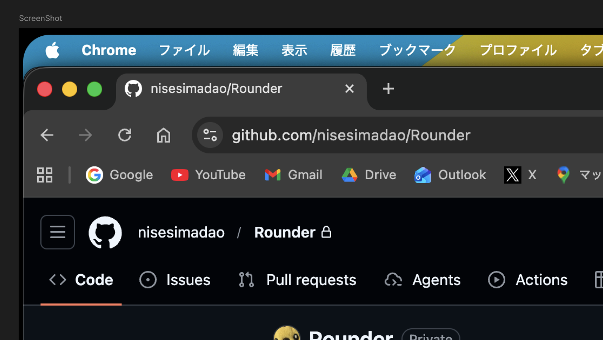

#  Rounder

macOSの画面の角を美しく角丸化するツール。

Notch導入以前のMacBookや外部モニターの直線的な角を、ソフトウェア制御のオーバーレイによってモダンな角丸に見せます。バックグラウンドで動作し、システムの動作に干渉しません。

[English README](./README.md)



> 注意: Notch搭載のMacの内蔵ディスプレイは、画面自体が物理的に角丸形状になっているため、本アプリの効果はありません。

## プロジェクト構成

```
Rounder/
├── Rounder/
│   ├── RounderApp.swift           # メインアプリケーションエントリ
│   ├── CornerOverlayWindow.swift  # 角丸オーバーレイウィンドウ
│   ├── ContentView.swift          # 高度な設定画面
│   ├── FirstLaunchSetupView.swift # 初回起動セットアップ
│   ├── MenuBarController.swift   # メニューバー制御
│   └── ScreenMonitor.swift        # 画面変更監視
├── Rounder.xcodeproj            # Xcodeプロジェクト
├── Rounder 開発仕様書.md          # 開発仕様書
└── README.md                     # このファイル
```

## 特徴

- **バックグラウンド動作**: 常駐アプリとしてメニューバーから操作
- **リアルタイム設定**: 角の半径や色を即座に反映
- **シンプルなインターフェース**: 直感的な設定画面
- **軽量で安定**: バックグラウンドで軽く動作

## システム要件

- macOS 14.6 (Sonoma) 以降
- Apple Silicon (M1/M2/M3) または Intel Mac
- アクセシビリティ権限が必要

## インストール

### ビルド済みアプリ（推奨）

1. [Releases](https://github.com/nisesimadao/rounder/releases) から最新版をダウンロード
2. アプリケーションフォルダに移動
3. 初回起動時に権限を許可

### ソースからビルド

```bash
# Xcodeでプロジェクトを開く
open Rounder.xcodeproj

# またはコマンドラインでビルド
xcodebuild -project Rounder.xcodeproj -scheme Rounder -configuration Release build
```

## 使い方

### 初回起動

1. アプリを起動するとセットアップウィザードが表示
2. 必要な権限（アクセシビリティ、画面録画）を許可
3. 角の半径と色を設定
4. 「Rounderを開始」で完了

### 通常使用

- **メニューバー**: Rounderアイコンから設定画面を開く
- **設定変更**: 角の半径（0-40px）と色をリアルタイムで調整
- **有効/無効**: 角丸効果のオン/オフを切り替え
- **終了**: アプリを完全に終了

## 設定オプション

### 一般設定
- **角の半径**: 0〜40ピクセルで調整可能
- **角の色**: カラーピッカーまたはプリセットから選択
- **有効化**: 角丸効果のオン/オフ

### 権限管理
- **アクセシビリティ権限**: 画面要素の検出に必要
- **画面録画権限**: スクリーンセーバーレベルでの表示に必要
- **自動化権限**: システムイベント監視に必要

## 技術仕様

### コア技術
- **SwiftUI + AppKit**: モダンなmacOSネイティブアプリ
- **Core Graphics**: 高性能なオーバーレイ描画
- **NSWindow.Level.screenSaver**: メニューバーより上のレイヤーで表示
- **UserDefaults**: 設定の永続化

### パフォーマンス
- **低負荷**: CPU使用率は最小限
- **メモリ効率**: 必要最小限のメモリ使用
- **リアルタイム反映**: 設定変更の即時適用

## トラブルシューティング

### よくある問題

**Q: 角丸が表示されない**
- A: アクセシビリティ権限が許可されているか確認してください

**Q: 設定変更が反映されない**
- A: 「適用」ボタンを押すか、アプリを再起動してください

**Q: メニューバーにアイコンがない**
- A: アプリがバックグラウンドで実行されているか確認してください

### 権限の再設定

```bash
# システム環境設定を直接開く
open "x-apple.systempreferences:com.apple.preference.security?Privacy_Accessibility"
```
