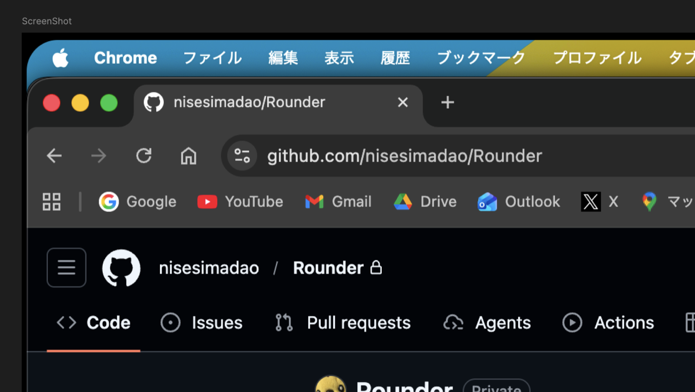
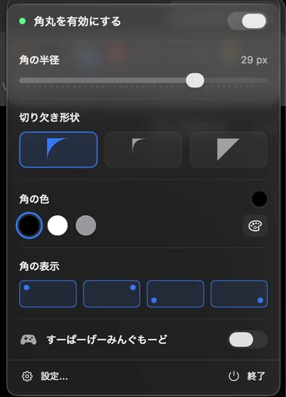
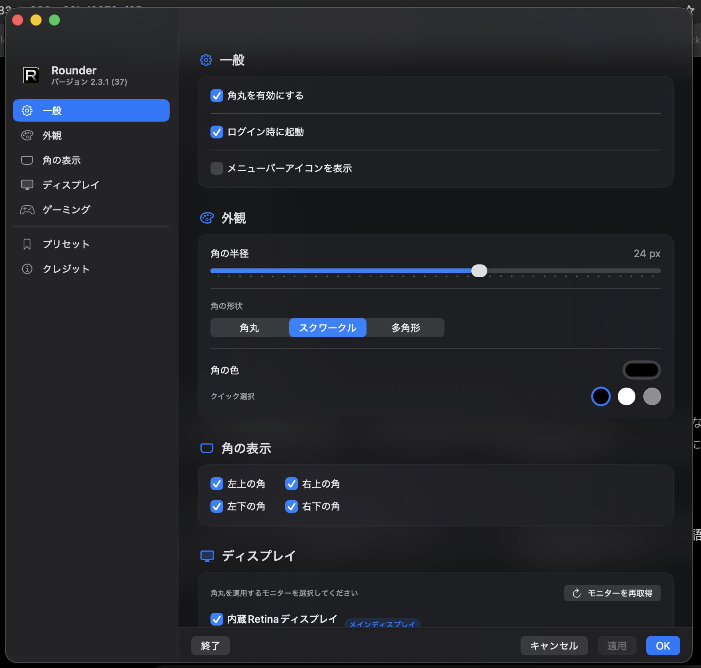

#  Rounder

Rounder は、macOS の画面四隅にオーバーレイを描画し、直線的なディスプレイの角を丸く見せるユーティリティです。

[](https://github.com/nisesimadao/Rounder/releases/latest)
[](https://github.com/nisesimadao/Rounder/actions/workflows/release.yml)
[](#システム要件)

<p align="center">
  
</p>

外部モニターや Notch 導入以前の Mac など、物理的な角が直線的なディスプレイで効果を確認しやすい設計です。
通常はメニューバーから操作し、必要であればメニューバーアイコンを隠したままバックグラウンドで動作させられます。
アクセシビリティ、画面収録、自動化、ネットワークの権限は使用しません。

[English README](./README.md)

## 主な機能

- **3 種類の角形状**：Rounded / Squircle / Polygon。
- **0〜40 px の角半径**：メニューバーから変更できます。
- **任意の角色**：カラーピッカーに加え、黒 / 白 / グレーの選択肢を用意しています。
- **四隅の個別切り替え**：各コーナーを個別に表示または非表示にできます。
- **マルチディスプレイ対応**：Rounder を適用する画面を選択できます。
- **プリセット**：設定を保存して再適用できます。
- **すーぱーげーみんぐもーど**：レインボー発光の速度、強度、Bloom 幅を変更できます。
- **ログイン時の起動**：`SMAppService` を使用します。
- **メニューバーアイコンの表示切り替え**：アイコンを隠しても Rounder はバックグラウンドで動作を続けます。
- **Dock に常駐しない構成**：Dock アイコンは初期設定中または設定画面を開いている間だけ表示します。
- **追加権限を使わない構成**：ローカルのオーバーレイと `UserDefaults` だけで動作します。

## メニューバーからの操作

メニューバーアイコンを表示している場合は、日常的な操作をパネルから実行できます。
Rounder の有効 / 無効、角半径、形状、クイック色、四隅の表示、すーぱーげーみんぐもーど、設定、終了をまとめています。



半径と形状は、既存のオーバーレイウィンドウをその場で更新します。
スライダー操作や形状の切り替えごとにウィンドウを作り直しません。

> Notch 搭載 Mac の内蔵ディスプレイは物理的に角が丸いため、Rounder の効果は目立ちません。
> 外部ディスプレイや古い Mac で確認すると違いが分かりやすくなります。

## ダウンロードとインストール

[Releases](https://github.com/nisesimadao/Rounder/releases/latest) から `Rounder.zip` をダウンロードし、解凍した `Rounder.app` を `/Applications` に移動します。

リリース版は ad-hoc 署名ですが、Developer ID 署名と公証は行っていません。
そのため、初回起動時に macOS Gatekeeper が起動を止める場合があります。

1. `Rounder.app` を右クリックし、**開く** を選択します。
2. 確認画面でもう一度 **開く** を選択します。

必要な場合は、quarantine 属性を手動で削除できます。

```bash
xattr -dr com.apple.quarantine /Applications/Rounder.app
```

詳しくは [FAQ](./docs/FAQ.ja.md) を参照してください。

## 初回起動

初回起動時は短いオンボーディングを表示します。

**ようこそ → 半径と色の基本設定 → 完了**

ログイン時に起動するかを選び、**Rounder を開始** を押すとバックグラウンドで動作を開始します。
メニューバーアイコンは、あとから設定で表示または非表示を切り替えられます。

## 設定

メニューバーパネルは、頻繁に使う設定を素早く変更するための画面です。
詳細な設定画面では、次の項目を変更できます。

- フルカラーピッカー。
- 対象ディスプレイ。
- プリセット管理。
- すーぱーげーみんぐもーどの速度 / 強度 / Bloom 幅。
- ログイン時の起動。
- メニューバーアイコンの表示 / 非表示。
- 四隅と表示方法の詳細設定。

メニューバーアイコンを非表示にしていても、`Rounder.app` を再度開くと設定画面を表示できます。
設定画面を開いただけではメニューバーアイコンを再表示しません。
再表示する場合は設定から明示的に有効にしてください。
ログイン時の自動起動では設定画面を表示しません。



## システム要件

- macOS 14.6 以降。
- Apple Silicon または Intel Mac。

## プライバシーと権限

Rounder は、アクセシビリティ、画面収録、自動化、連絡先、位置情報、マイク、カメラ、ネットワークの権限を要求しません。
設定は Mac 内の `UserDefaults` に保存します。

詳しくは [Privacy](./docs/PRIVACY.md) と [Security](./docs/SECURITY.md) を参照してください。

## 技術メモ

- SwiftUI + AppKit。
- `.screenSaver` レベルのボーダーレス `NSWindow` オーバーレイ。
- Core Graphics / Core Animation による角描画。
- 通常の `NSMenu` 内に SwiftUI の操作パネルを配置し、macOS のメニュートラッキングを維持します。
- 初回配置、ライブリサイズ、メニュープレビュー、角の向き、Gaming hue mapping は `CornerGeometry` / `ScreenCorner` を共通の定義として使用します。
- 半径と形状は既存ウィンドウを更新し、構造が変わる設定ではオーバーレイを再生成します。

## ソースからビルド

```bash
open Rounder.xcodeproj
```

コマンドラインからは次のようにビルドできます。

```bash
xcodebuild -project Rounder.xcodeproj -scheme Rounder -configuration Release build
```

## リリースと CI

`vX.Y.Z` タグを push すると、Release workflow が角形状の回帰テストと必須の日英ローカライズを確認します。
検証後、`Rounder.zip` をビルドして公開します。

## プロジェクト文書

- [Changelog](./docs/CHANGELOG.md)
- [FAQ 日本語](./docs/FAQ.ja.md)
- [FAQ English](./docs/FAQ.md)
- [Privacy](./docs/PRIVACY.md)
- [Security](./docs/SECURITY.md)
- [Contributing](./docs/CONTRIBUTING.md)
- [Demo asset checklist](./docs/DEMO_ASSETS.md)
- [Launch checklist](./docs/LAUNCH_CHECKLIST.md)
- [License](./LICENSE)

## トラブルシューティング

**角丸が表示されない**  
Rounder が有効になっているか、設定で対象ディスプレイが選択されているか確認してください。
Notch 搭載 Mac の内蔵画面は物理的に角が丸いため、外部ディスプレイで確認すると違いが分かりやすくなります。

**変更が反映されていないように見える**  
半径と形状は、メニューバーで操作した時点で反映されます。
ディスプレイ選択など構造が変わる設定で表示が不自然な場合は、Rounder を一度無効にしてから再度有効にするか、設定からディスプレイ一覧を再取得してください。

**メニューバーアイコンを再表示したい**  
`Rounder.app` を開いて設定画面を表示し、**メニューバーアイコンを表示** を有効にしてください。
アイコンを非表示にしていても Rounder 自体は動作を続けます。
